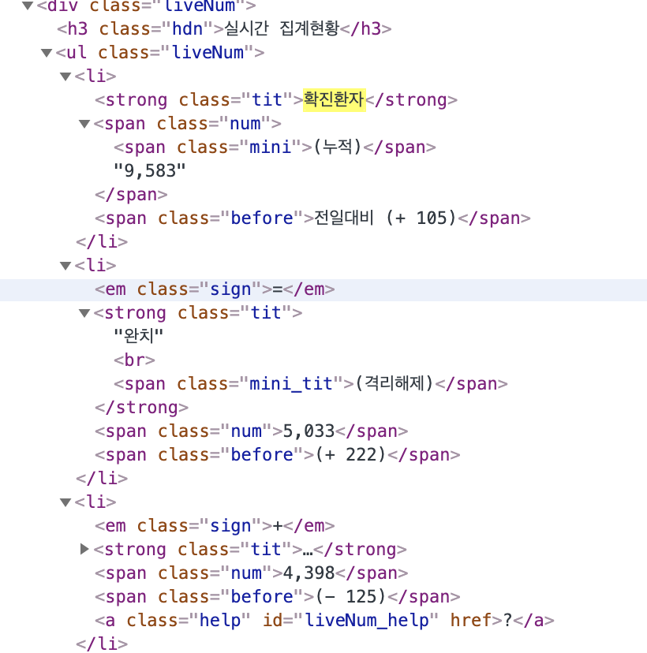
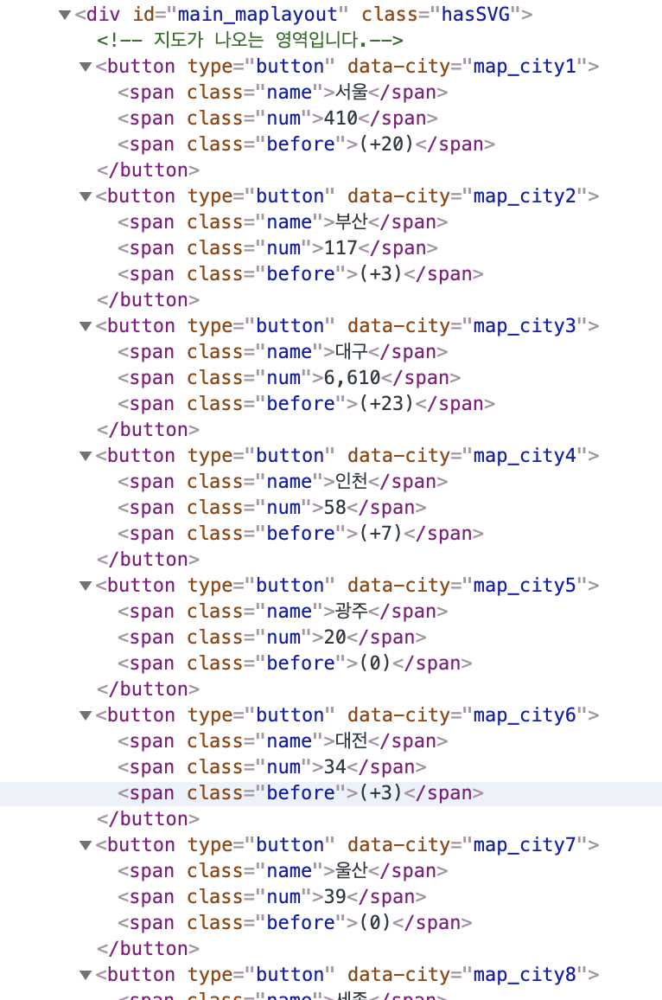
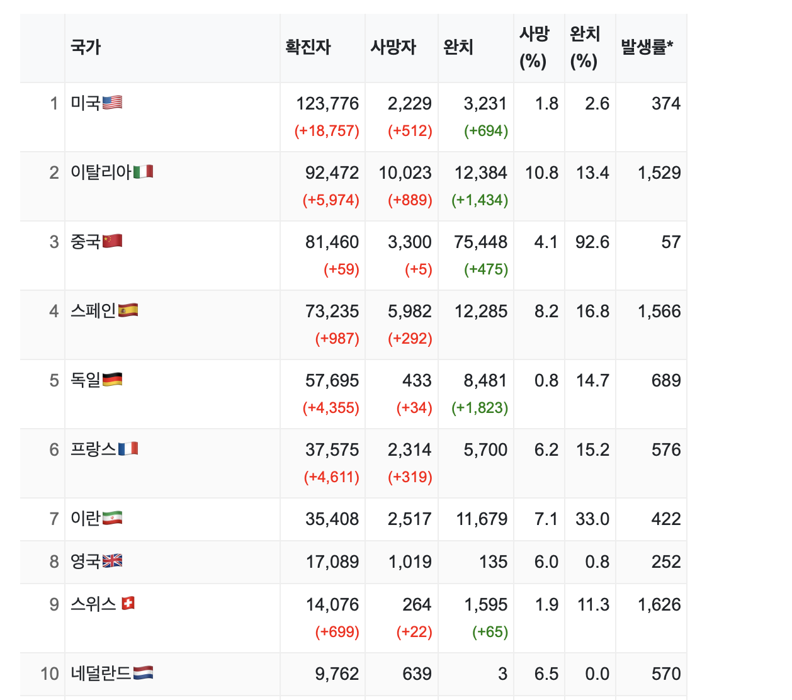
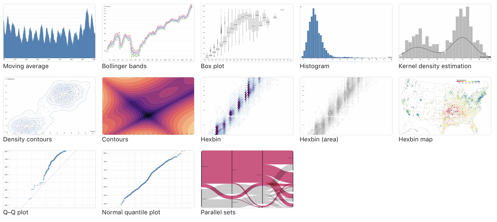

# Search for issue

### Contributor 👩‍💻 

[최은지](https://github.com/ChoiEunji0114)

### My Issue 🛠 : COVID 19

- 실시간 정보
  - 전 세계 확진 현황
  - 주요 국가별 확진 현황 (혹은 확진자 수가 많은 순..)
  - 우리나라 확진 현황
  - 서울 확진 현황
- 실시간 마스크 판매 정보 >> 그래서 어디가 부족한 지, 어느 곳에 우선적으로 마스크가 보급되어야 하는지 분석
- 


### Data Search

- [실시간 대한민국 코로나 확진 정보](http://ncov.mohw.go.kr) : web scraping 으로 실시간 정보를 불러오면 될듯 함   



> 확진환자 (누적, 전일 대비), 완치, 치료중, 사망 확인 가능



> 시도별 확진환자 현황 확인 가능

- [공적 마스크 판매 정보](https://www.data.go.kr/dataset/15043025/openapi.do) : API 제공

```json
{
  "count": 500,
  "page": "1",
  "storeInfos": [
    {
      "addr": "충청남도 홍성군 갈산면 상촌로 12-1,",
      "code": "34840559",
      "lat": 36.6029863,
      "lng": 126.5489114,
      "name": "신신약국",
      "type": "01"
    }
..
```

- [전 세계 코로나 확진 정보](https://coronaboard.kr)



> 국가별 확진자, 사망자, 완치, 사망률, 완치율, 발생률 조회 가능

- [Kaggle](https://www.kaggle.com)
  - [COVID 19 world dataset](https://www.kaggle.com/allen-institute-for-ai/CORD-19-research-challenge)
    > 4기가 dataset.. 데이터 전처리 꼼꼼히 해줘야 할 듯 ㅠ   
    > 좋은 데이터들이 많음. 환자 정보, search trend, 지역 정보 등등.. 제대로 활용만 한다면..!


### Data Visualization Tool

- [D3](https://d3js.org)



> 제대로 사용해 본 적이 없어서 제대로 공부해야 할 듯 함.. 깔끔하고 예쁜 툴들이 굉장히 많음 🥺

- R
- Python
- iOS ❓

### 조사하며..

- 최근에 발생한 이슈다 보니 아무래도 빅데이터들이 부족함. 실시간 데이터들이 대부분임 


### 추가 분석 사항

- 마스크 검색 현황과 연관 지어도 괜찮을 듯 함 (이거 좀 더 찾아보기로.. )
- 그 전 전염병(사스, 메르스 등) 추이와 비교해보기


> 참고 자료들 : [코로나 데이터 분석 사이트](https://pinkwink.kr/1274),
[소비자 반응 분석](http://www.openads.co.kr/nTrend/article/소비자분석/7029/코로나19-빅데이터-소비자-반응-분석-마스크)
